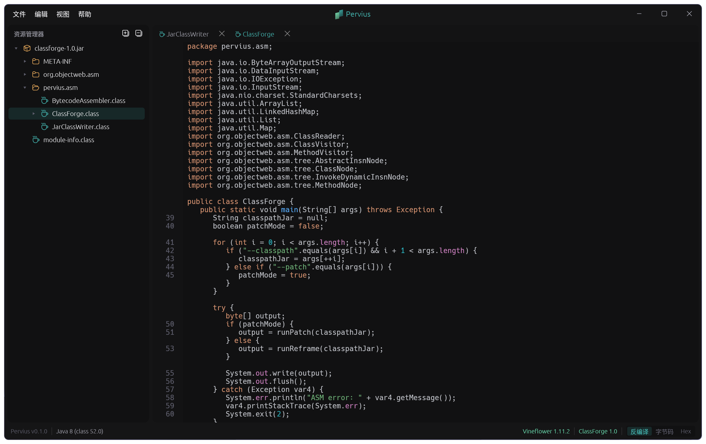
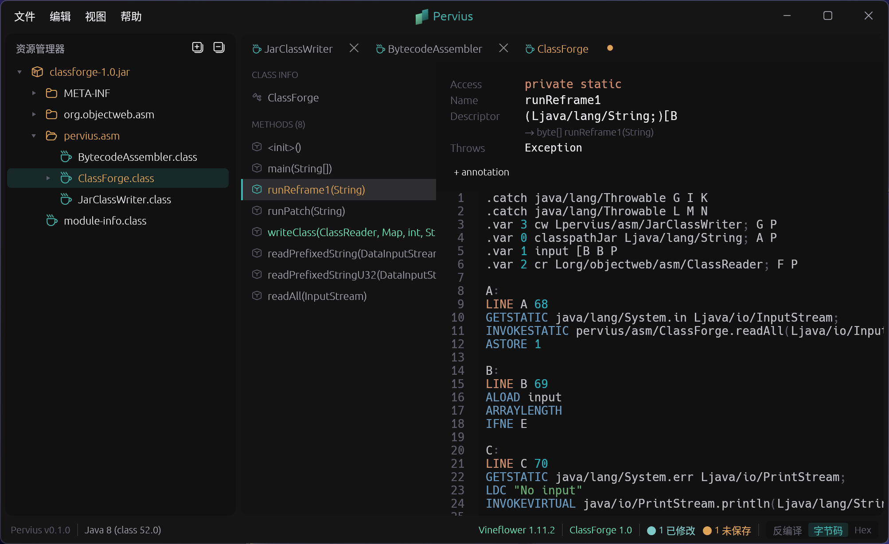
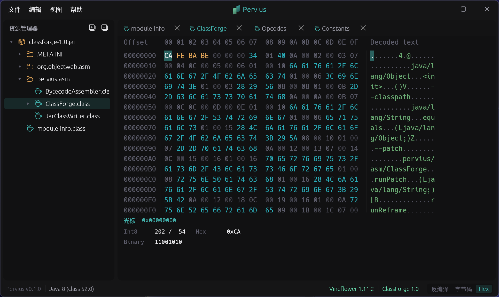
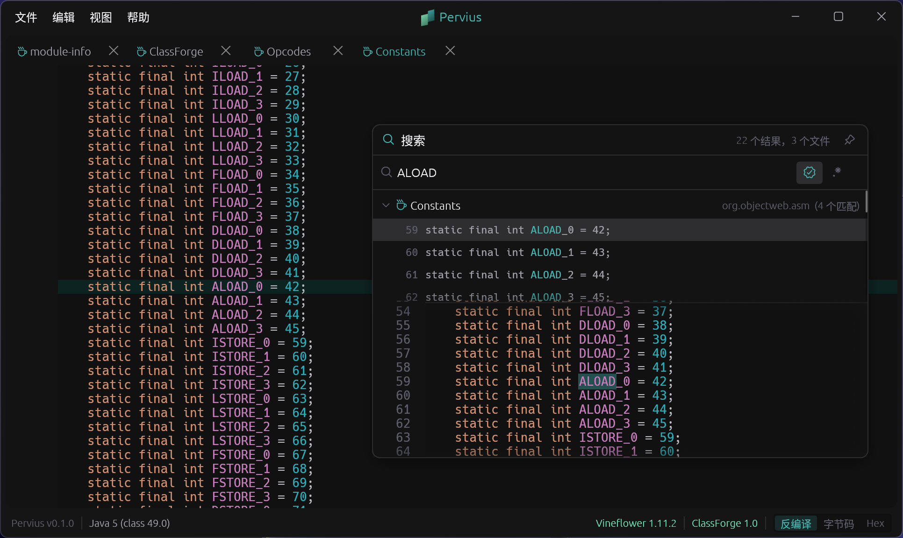
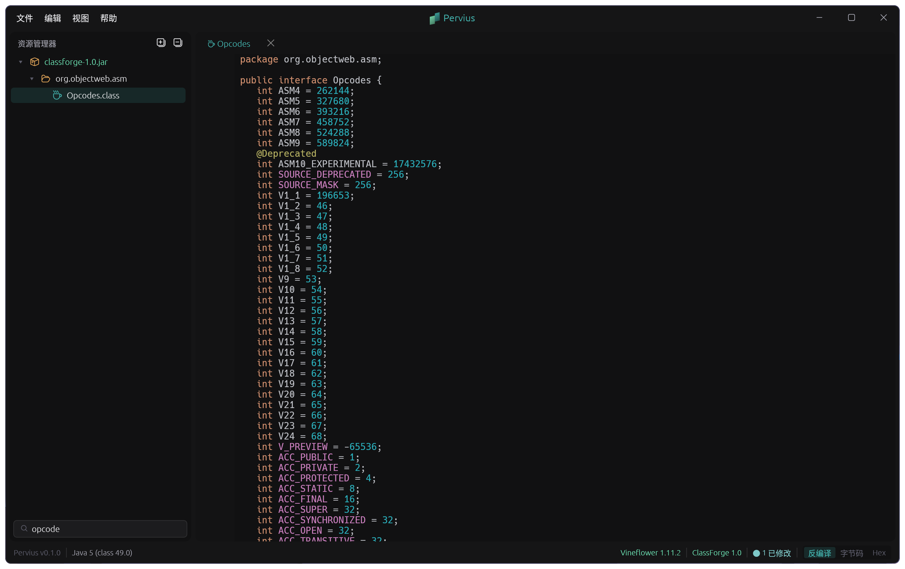

<div align="center">


# Pervius

**现代化的 Java / Kotlin 反编译、源码重编译与字节码编辑工具。**

[Vineflower](https://github.com/Vineflower/vineflower) 反编译 · [ClassForge](classforge/) 字节码重写 · Rust 原生界面

[](https://www.rust-lang.org/)
[](https://github.com/emilk/egui)
[](#运行要求)
[](LICENSE)</br>
[](https://github.com/Vineflower/vineflower)
[](classforge/)

[特性](#特性) · [运行要求](#运行要求) · [构建](#构建) · [快捷键](#快捷键) · [English](README.md)

</div>

## 特性

### 反编译

基于 Vineflower，支持 JAR 批量反编译和单文件按需反编译。小体积 JAR 自动全量反编译，大 JAR 按需逐类反编译。Vineflower 输出实时解析进度，逐类跟踪。结果按 JAR 的 SHA-256 缓存，重复打开不重编译。Kotlin 类可配置输出为 `.kt`（Vineflower/Kotlin 输出）或 `.java`（Java 输出模式），并保留原始行号映射。



### 字节码编辑

结构化 `.class` 编辑面板：左侧导航类信息、字段、方法，右侧对应编辑区。可修改访问标志、继承关系、注解、描述符，方法指令也可直接编辑。保存时 ClassForge（基于 ASM 9.7）自动处理常量池重建、StackMapTable 重算和 max_stack/max_locals。未修改方法直接字节拷贝，仅对改动方法触发帧重算。



### 源码重编译

反编译出的 Java / Kotlin 源码可在代码区右键菜单中解锁编辑（`右键` → **允许编辑**）。`Ctrl+S` 或 **立即重新编译** 会异步编译当前源码，并把生成的 `.class` 条目替换到内存中的 JAR。Java 重编译使用 JDK 的 `javax.tools.JavaCompiler`；Kotlin 重编译使用独立 `-cp` 启动路径加载 `kotlin-compiler-embeddable`，因此 ClassForge 的普通模式不会加载 Kotlin 编译器。编译诊断会回填到编辑器，以 gutter 标记展示，且不阻塞继续编辑。

源码编辑与结构化字节码编辑互斥：切换前需要先保存或放弃其中一种编辑路径。

### 三视图

每个 `.class` 可通过 `Tab` 在三种视图间切换：

- **反编译视图** — 语法高亮的 Java/Kotlin 源码，默认只读，可解锁后进行源码重编译
- **字节码视图** — 结构化编辑面板
- **Hex 视图** — 交互式十六进制查看器

非 `.class` 的文本文件（XML、YAML、JSON 等）直接可编辑，带语法高亮；二进制文件以 Hex 视图打开。



### 代码导航

`Ctrl+Click`（macOS `Cmd+Click`）跳转到类、方法、字段的定义。支持 import 解析、同包推断和通配符匹配。在方法声明处 `Ctrl+Click` 触发 Find Usages，自动搜索所有引用。

### 全局搜索

`Double Shift` 打开搜索面板，覆盖所有反编译源码，支持正则和大小写敏感。结果流式返回，按类分组，行级高亮预览，双击跳转。反编译完成后后台自动建索引，不阻塞 UI。



### 归档浏览

左侧资源树展示 JAR 内容，支持 `jar` `zip` `war` `ear`。键入即过滤（Speed Search），过滤计算在后台线程完成。修改状态实时标记，反编译状态实时可见。文件拖到 Explorer 或 Classpath 区域时，可按普通打开或添加到编译 Classpath 处理，目标区域会有悬停反馈，且拖拽行为可在设置中配置。Classpath 面板直接集成在资源树下方，并支持通过拖拽上边界调整高度。最近文件列表也会同步维护。



### 导出

- **导出 JAR**（`Ctrl+Shift+S`）— 修改写回 JAR，生成新归档
- **导出反编译源码**（`Ctrl+Shift+E`）— 导出 `.java`/`.kt` 到指定目录，保留包结构

## 运行要求

- 反编译器 / ClassForge 执行需要可用的 Java 运行时；Pervius 可使用设置页配置的 Java 路径、`JAVA_HOME`，或 `PATH` 中的 `java`
- Java 和 Kotlin 源码重编译需要 **JDK**（不能只是 JRE），因为 ClassForge 会调用系统 `javac`
- Vineflower 与 Kotlin 编译依赖会从华为云 Maven 镜像自动下载到“环境”工具目录（默认位于反编译缓存根目录下）

ClassForge 已内置，首次运行自动释放到数据目录。Vineflower 从“环境”中配置的目录解析并按需下载；可执行文件同目录下匹配版本的 `vineflower-{version}.jar` 仍具备最高优先级，便于本地/离线覆盖。Kotlin 依赖（`kotlin-stdlib` 与 `kotlin-compiler-embeddable`）为保持默认分发体积不会内置，仅在 Kotlin 源码重编译时按需下载。下载进度会显示在状态栏中，而仅以 POM 元数据形式存在、并不发布 JAR 的 Maven 工件会在依赖解析时自动跳过。

## 构建

```bash
cargo build --release
```

ClassForge 已通过 `include_bytes!` 内置到二进制中；Vineflower 与 Kotlin 依赖由“环境”设置解析并按需下载，下载进度会显示在状态栏中。

构建 ClassForge（仅需在修改 ClassForge 源码后重新执行）：

```bash
cd classforge
./gradlew jar    # Windows: .\gradlew.bat jar
```

ClassForge 以 `compileOnly` 方式声明 Kotlin 依赖：Gradle / javac 可以对 `KotlincCompiler` 做类型检查，但 Kotlin stdlib/compiler 不会打进 `classforge-*.jar`。将产出的 ClassForge JAR 复制到 `crates/pervius-java-bridge/libs/` 替换同名文件，重新编译 Rust 即可。运行时 Kotlin 重编译会自动下载已配置版本的 Kotlin 依赖。

```bash
cargo run --release
```

## 快捷键

| 快捷键 | 操作 |
|:-------|:-----|
| `Ctrl+O` | 打开归档或单文件 |
| `Ctrl+S` | 保存 / 重编译已解锁源码 |
| `Ctrl+F` | 查找 |
| `Double Shift` | 全局搜索 |
| `Ctrl+Click` | 跳转到定义 / Find Usages |
| `Tab` | 切换视图 |
| `Alt+1` | 切换资源树 |
| `Ctrl+Shift+S` | 导出 JAR |
| `Ctrl+Shift+E` | 导出反编译源码 |
| `Ctrl+,` | 设置 |

所有快捷键可在设置中自定义。

## 致谢

- [Vineflower](https://github.com/Vineflower/vineflower) — Java 反编译引擎
- [ASM](https://asm.ow2.io/) — Java 字节码操作框架
- [egui](https://github.com/emilk/egui) — Rust immediate mode GUI
- [tree-sitter](https://tree-sitter.github.io/tree-sitter/) — 语法高亮

## 许可证

[MIT](LICENSE)
